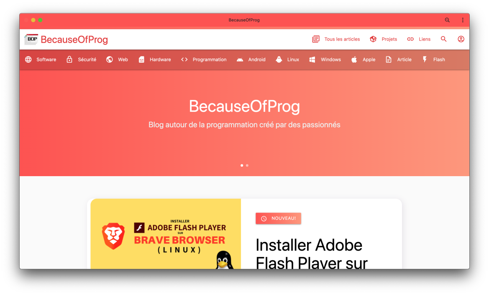

  
  <h1>BecauseOfProg's blog</h1>
  <a href="https://becauseofprog.fr">Website</a> &mdash; <a href="https://discord.becauseofprog.fr">Discord chat</a> 
  
  

- [💻 Development](#-development)
  - [Requirements](#requirements)
  - [Project setup](#project-setup)
  - [Serve for development](#serve-for-development)
  - [Build for production](#build-for-production)
- [📜 Credits](#-credits)
- [🔐 License](#-license)

## 💻 Development

Thanks for being involved in the grow of our project! Please read these few lines in order to get started.

### Requirements

- Python 3.5+
- NodeJS 10+

### Project setup

- Clone the repository from git
- Install the Python dependencies : `pip install -r requirements.txt`
- Install the NodeJS dependencies : `npm i` or `yarn install`

### Serve for development

- Run the Rollup development server : `npm run dev` or `yarn dev`
- Start the `run.py` script

### Build for production

- Compile the CSS and Javascript bundle : `npm run build` or `yarn build`
- Add a systemd service to serve the blog-old with uWSGI (a configuration file for uWSGI is included: site-bop-v3.ini)

## 📜 Credits

- Maintainers: [Gildas GH](https://github.com/Gildas-GH), [Théo Vidal (exybore)](https://github.com/exybore)
- Special thanks to [Noéwen (kernoeb)](https://github.com/kernoeb) (BecauseOfProg)

## 🔐 License

GNU GPL v3. See the [license file](./LICENSE)
